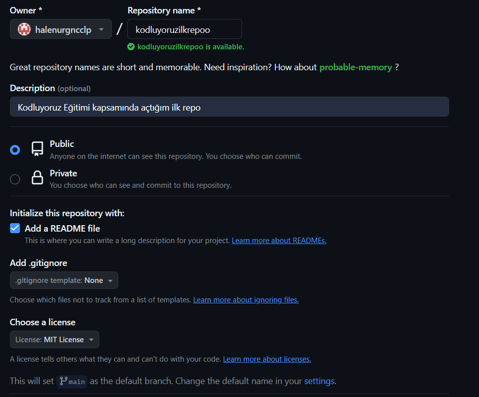

# Kodluyoruz İlk Repo
Bu repo [Kodluyoruz](https://www.kodluyoruz.org) Front-End Eğitiminde oluşturduğumuz ilk repo.İçerisinde bir adet 
README dosyası,bir adet de index.html barındırıyor.



# Installation
Öncelikle projeyi clonelayın.

`git clone https://github.com/halenurgncclp/kodluyoruzilkrepo.git`

# Usage
 Projeyi cloneladıktan sonra Visiul Studio Code programında açınız.

Linux için:

```linux
cd kodluyoruzilkrepo
code .
```

# Contributing

Pull requestler kabul edilir.Büyük değişiklikler için,lütfen önce neyi değiştirmek istediğinizi tartışmak için bir konu açınız.

# License
[ MIT ]( https://link-url-here.org/ ) 